<div align="center">


 &nbsp;<b>OPEN TO SOFTWARE ENGINEERING OPPORTUNITIES</b>

<sub>Full-Stack · Backend · AI · Systems</sub>

<br>


<br>

<a href="https://github.com/Bharathi9705"></a>
<a href="https://www.linkedin.com/in/bharathi-a-91543b290/"></a>
<a href="https://bharathi9705.github.io/"></a>
<a href="https://leetcode.com/u/BharathiArumugam/"></a>
<a href="https://mail.google.com/mail/?view=cm&fs=1&to=bharathi20061882@gmail.com"></a>

</div>

<br>

```
SIGNAL  →  SYSTEM  →  CODE  →  INTELLIGENCE  →  PRODUCT
 (ECE)     (Networks)  (Software)   (AI)         (Shipped)
```

<div align="center"><sub>trained to read one, built to ship the other</sub></div>

<br>

<p align="center">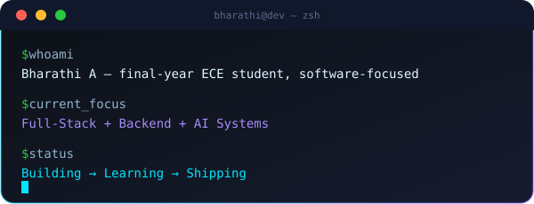</p>

<p align="center"></p>

## ⟨ 01 ⟩ ABOUT

> Trained to read signals. Built to ship systems.

<p align="center">

</p>

I'm a final-year Electronics & Communication Engineering student who ended up on the software side of things — building full-stack products, wiring backend systems together, and shipping AI-integrated applications that actually run in production, not just in a notebook. My ECE background shows up in how I think about software: as systems with failure modes, not just features.

<table>
<tr><td>

```
SYSTEM PROFILE
──────────────────────────────────────────
ROLE        → Aspiring Full-Stack Developer
FOCUS       → Full-Stack · Backend · AI
FOUNDATION  → Electronics & Communication
BUILDING    → Practical software products
EXPLORING   → LLMs · System Design
STATUS      → Preparing for SWE roles
──────────────────────────────────────────
```

<p align="center"></p>

</td></tr>
</table>

<table>
<tr>
<td width="50%">

**CURRENTLY BUILDING**
Full-Stack Apps
AI Applications
Backend Systems

</td>
<td width="50%">

**CURRENTLY LEARNING**
Advanced Java
DSA
System Design

</td>
</tr>
<tr>
<td width="50%">

**SOFTWARE**
React · Flask
Node · FastAPI
Firebase

</td>
<td width="50%">

**ECE / HARDWARE**
ESP32
Raspberry Pi
IoT

</td>
</tr>
</table>

<p align="center"></p>

## ⟨ 02 ⟩ TECH ARSENAL

<p align="center"></p>

<table>
<tr>
<th align="center">Languages</th>
<th align="center">Frontend</th>
<th align="center">Backend</th>
<th align="center">Databases</th>
</tr>
<tr>
<td align="center"><br><sub>+ SQL</sub></td>
<td align="center"></td>
<td align="center"></td>
<td align="center"></td>
</tr>
</table>

<table>
<tr>
<th align="center">Systems / IoT</th>
<th align="center">Tools</th>
<th align="center">Deployment</th>
<th align="center">AI</th>
</tr>
<tr>
<td align="center"><br><sub>+ ESP32 · Networking</sub></td>
<td align="center"><br><sub>+ Postman</sub></td>
<td align="center"><br><sub>+ GitHub Pages</sub></td>
<td align="center"><sub>LLMs · Generative AI<br>AI Integration</sub></td>
</tr>
</table>

<p align="center">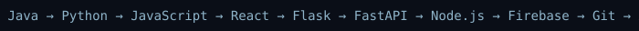</p>

<p align="center"></p>

## ⟨ 02.5 ⟩ SIGNALS & SYSTEMS

<p align="center">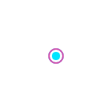</p>

<div align="center"><sub>The ECE core underneath the software</sub></div>

<table>
<tr>
<td align="center" width="20%"><b>ESP32</b><br><sub>IoT & wireless comms</sub></td>
<td align="center" width="20%"><b>Raspberry Pi</b><br><sub>IoT automation & architecture</sub></td>
<td align="center" width="20%"><b>RF / Wi-Fi</b><br><sub>RSSI · signal mapping</sub></td>
<td align="center" width="20%"><b>Embedded Systems</b><br><sub>Sensors · real-time response</sub></td>
<td align="center" width="20%"><b>Networking</b><br><sub>Cisco · comms systems</sub></td>
</tr>
</table>

**Hardware & Field Work**
- **Smart Indoor RF Signal Mapping** — Wi-Fi RSSI data collection, Python processing, signal visualization / heatmaps
- **Driver Drowsiness & Safety Detection** — real-time sensor data processing with alert generation
- **ESP32 IoT Home Automation** — presented at Sensonics 2024, Kongu Engineering College
- **Raspberry Pi IoT Automation** — hands-on workshop, Shaastra 2025, IIT Madras
- **Southern Railway** — signaling & real-time communication systems exposure *(see Experience)*

<p align="center"></p>

## ⟨ 03 ⟩ ENGINEERING LAB

<p align="center">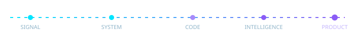</p>

<table>
<tr>
<td align="center" width="20%"><b>FULL-STACK</b><br><sub>React · Next.js<br>Node · Flask · APIs</sub></td>
<td align="center" width="20%"><b>AI APPLICATIONS</b><br><sub>LLMs · AI integration<br>intelligent systems</sub></td>
<td align="center" width="20%"><b>BACKEND SYSTEMS</b><br><sub>REST APIs · databases<br>authentication</sub></td>
<td align="center" width="20%"><b>SYSTEMS & IoT</b><br><sub>Raspberry Pi · ESP32<br>networking</sub></td>
<td align="center" width="20%"><b>PROBLEM SOLVING</b><br><sub>DSA · SQL · OOP<br>System Design</sub></td>
</tr>
</table>

<p align="center"></p>

## ⟨ 04 ⟩ EXPERIENCE

```
2026
│
├── THIRANEX
│   Full Stack Development Intern · May – Jun 2026
│   Full-stack web applications · REST APIs
│   Backend services · Database operations
│
├── CODEALPHA
│   App Development Intern · 2026
│   React + Firebase apps · Fitness Tracker · LinguaLearn
│
2025
│
└── SOUTHERN RAILWAY
    Technical / Signaling Intern · Jun 2025 · 14 days
    Railway signaling · Communication systems
    Real-time coordination · Safety-critical operations
```

<p align="center"></p>

## ⟨ 05 ⟩ FEATURED PROJECTS

<table width="100%" border="0" cellspacing="0" cellpadding="0">
<tr>
<td width="50%" align="center" valign="top">

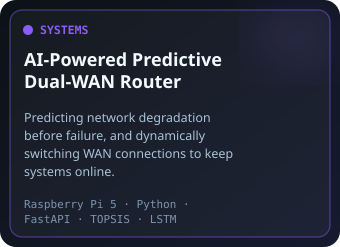

<a href="https://github.com/Bharathi9705/dual-wan-failover"></a>

</td>
<td width="50%" align="center" valign="top">

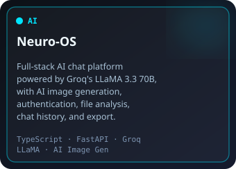

<a href="https://github.com/Bharathi9705/neuro-os"></a>
<a href="https://neuro-os-alpha.vercel.app/"></a>

</td>
</tr>
<tr>
<td width="50%" align="center" valign="top">

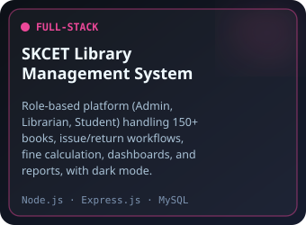

<a href="https://github.com/Bharathi9705/skcet-library-management"></a>
<a href="https://skcet-library-management.onrender.com/"></a>

</td>
<td width="50%" align="center" valign="top">

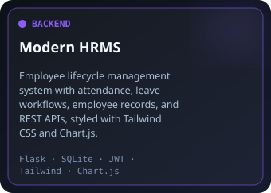

<a href="https://github.com/Bharathi9705/modern-hrms-flask"></a>
<a href="https://modern-hrms-flask.onrender.com/"></a>

</td>
</tr>
</table>

<p align="center"></p>

## ⟨ 06 ⟩ ENGINEERING IDENTITY

<p align="center">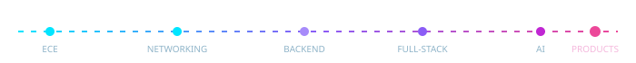</p>

I don't just learn technologies — I build systems with them. The dual-WAN router isn't a tutorial project; it's a networking problem (my ECE core) solved with a backend service, a prediction model, and a live dashboard — the exact same pipeline that turns into a full-stack product when the domain changes from packets to people.

<p align="center"></p>

## ⟨ 06.5 ⟩ ENGINEERING MINDSET

<p align="center">

</p>

<p align="center"></p>

## ⟨ 07 ⟩ GITHUB COMMAND CENTER

<div align="center">


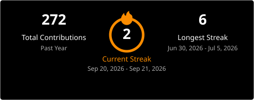


</div>

<p align="center"></p>

## ⟨ 08 ⟩ QUOTE OF THE DAY

<p align="center">

<!-- QUOTE:START -->
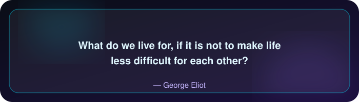
<!-- QUOTE:END -->

</p>

<p align="center"></p>

## ⟨ 09 ⟩ CERTIFICATIONS

<p align="center">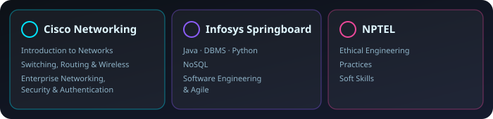</p>

<p align="center"></p>

## ⟨ 10 ⟩ ENGINEERING ACTIVITIES

<p align="center">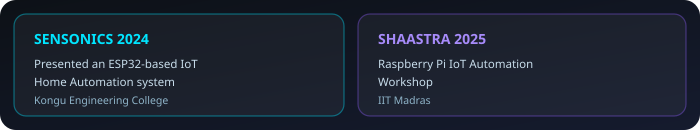</p>

<p align="center"></p>

## ⟨ 11 ⟩ EDUCATION

<p align="center">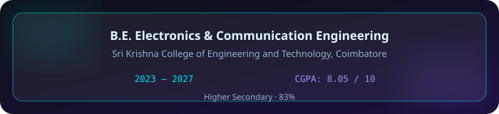</p>

<p align="center"></p>

<div align="center">

**BUILD → LEARN → SHIP → REPEAT**

`< engineered with curiosity />`

</div>
